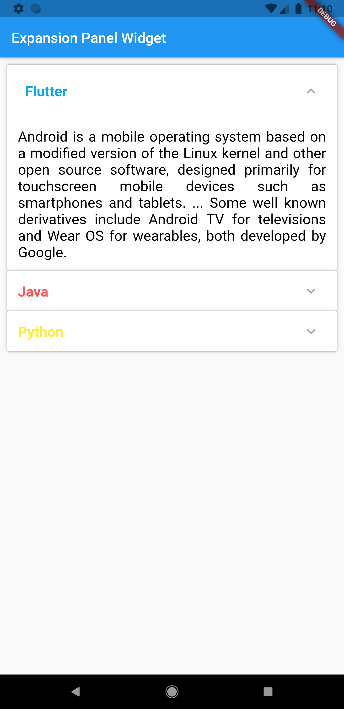
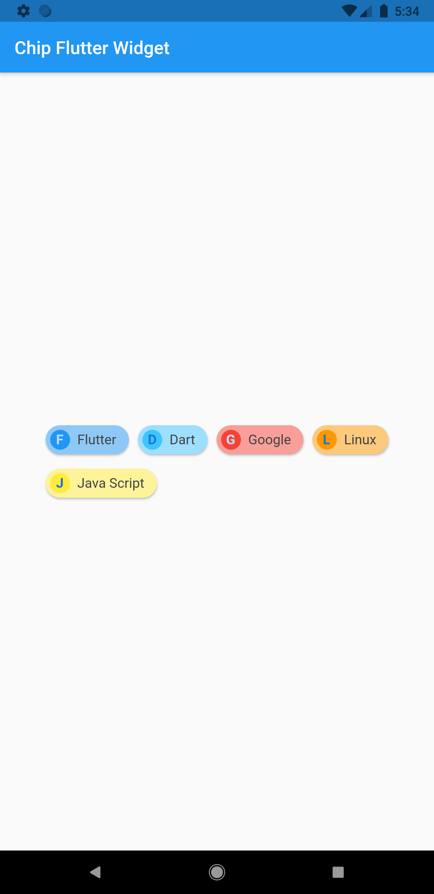
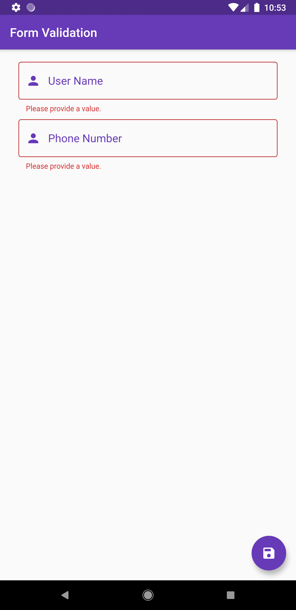

    <h3>ویجت های فلاتر همراه با مثال عملی</h3> 
    <b>سلام دوستان</b>
    
در این ریپازیتوری من قصد دارم ویجت های جالب فلاتر را به همراه مثال عملی با شما به اشتراک بزارم.

    <h5>مثال ویجت ها به شرح زیر می باشد:</h5> 

- <a href="expansion_panel_widget/"> Expansion Panel Widget </a> 

  

- <a href="chip_widget/"> Chip Widget </a> 

  

- <a href="validating_user_input/"> Validating User Input -- Form Widget </a> 

  

<h4>توجه !</h4>

لازم به ذکر می باشد در صورت تمایل میتوانید در تکمیل و توسعه این ریپازیتوری همکاری کنید.

<h4>اطلاعات توسعه دهنده</h4>
- ایمیل: amirhosseinjahangiri78@gmail.com

